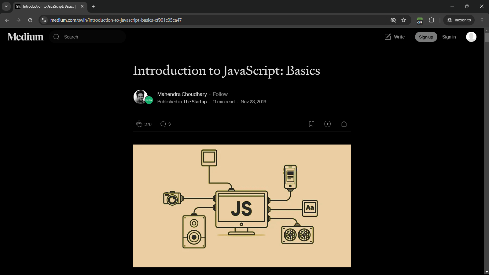
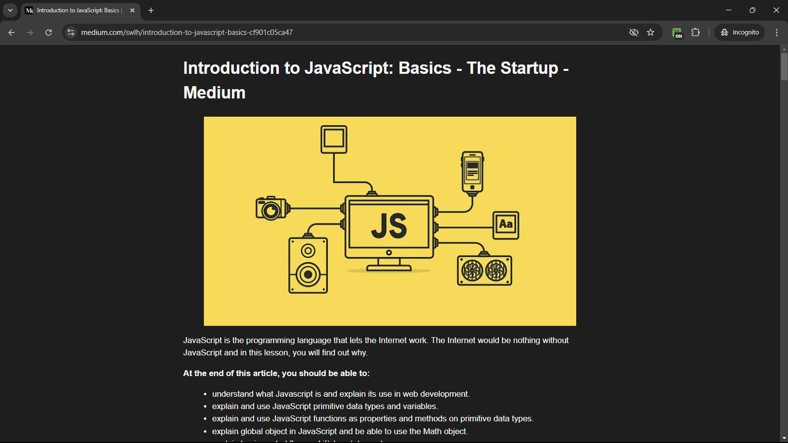

# Mode Membaca (Discontinued)

Ekstensi Chrome untuk mengaktifkan mode membaca dengan menghilangkan konten-konten yang mengganggu pengalaman membaca.

## Deskripsi
**Mode Membaca** adalah ekstensi Chrome yang berfungsi untuk meningkatkan pengalaman membaca di web dengan menyederhanakan tampilan halaman. Ekstensi ini menghilangkan elemen-elemen yang tidak relevan seperti iklan, sidebar, atau konten tambahan yang mengganggu, sehingga pengguna bisa fokus pada artikel atau teks yang dibaca. Ekstensi dapat diaktifkan dan dinonaktifkan dengan satu klik. Ekstensi ini hanya dapat digunakan di **desktop**.

## Fitur
- Mengaktifkan mode membaca yang menyederhanakan tampilan halaman web.
- Memudahkan pengguna untuk fokus pada konten utama tanpa gangguan.
- Dapat dinyalakan dan dimatikan dengan mudah melalui ikon ekstensi.

## Instalasi
Ikuti langkah-langkah berikut untuk menginstal ekstensi ini secara lokal di browser Chrome:

1. **Unduh** atau clone repositori ini. Jika mengunduh dalam format zip, ekstrak file zip tersebut.
2. Buka Chrome, klik ikon menu (tiga titik) di pojok kanan atas layar.
3. Pilih **Ekstensi** dari menu, kemudian klik **Kelola Ekstensi**.
4. Aktifkan **Mode Pengembang** dengan mengaktifkan tombol di pojok kanan atas halaman Ekstensi.
5. Klik tombol **Muat yang belum dibuka** dan pilih folder tempat kamu mengekstrak atau meng-clone repositori ini.
6. Ekstensi **Mode Membaca** sekarang akan muncul di daftar ekstensi. Aktifkan ekstensi dengan menggeser tombol toggle.

## Cara Penggunaan
1. Buka tab dengan konten yang ingin kamu baca dalam mode membaca.
2. Klik ikon ekstensi **Mode Membaca** di toolbar Chrome.
3. Mode membaca akan aktif, dan halaman akan disederhanakan secara otomatis.
4. Untuk mematikan mode membaca, klik kembali ikon ekstensi.
5. Pastikan untuk mematikan ekstensi ini sebelum membuka tab lain agar tidak mengganggu tampilan tab berikutnya.

## Lisensi
Ekstensi ini menggunakan beberapa lisensi, termasuk:
- **License Utama**: [LICENSE.md](./LICENSE.md) - berisi informasi bahwa software ini menggunakan library **Mozilla's Readability** dan ikon **GoogleChrome** dari repositori chrome-extensions-samples.
- **License Readability**: [LICENSE-Readability.md](./LICENSE-Readability.md) - lisensi tambahan terkait penggunaan library Readability dari Mozilla.
- **License GoogleChrome**: [LICENSE-GoogleChrome.md](./LICENSE-GoogleChrome.md) - lisensi tambahan terkait penggunaan ikon dari GoogleChrome.

## Contoh Penggunaan

### Sebelum Mengaktifkan Mode Membaca
Contoh tampilan halaman di **medium.com** sebelum menggunakan ekstensi Mode Membaca.

### Sesudah Menggunakan Mode Membaca
Contoh tampilan halaman di **medium.com** setelah mode membaca diaktifkan, menunjukkan tampilan yang lebih sederhana dan bebas gangguan.

## Keterangan Tambahan
- Pengembangan ekstensi ini telah **dihentikan** karena hasil yang dihasilkan oleh library Readability tidak konsisten di berbagai situs.
- Terdapat kesulitan dalam membuat **CSS Rules** yang dapat mencakupi berbagai jenis situs di internet secara efektif.

